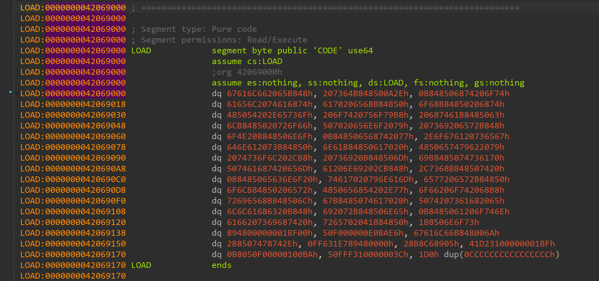
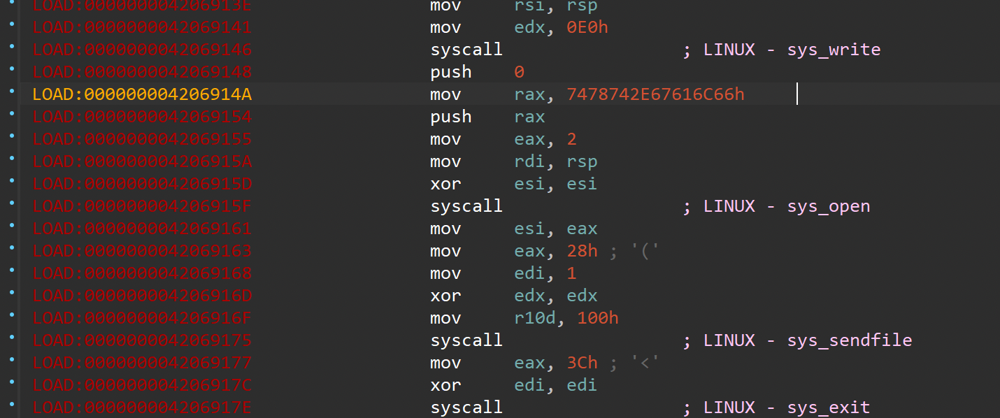
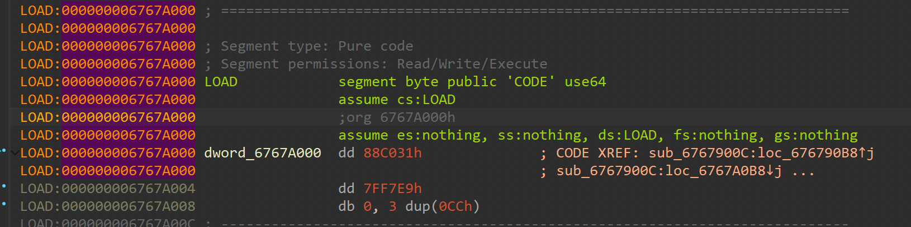
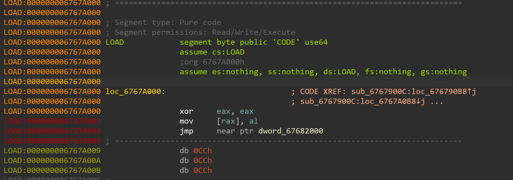
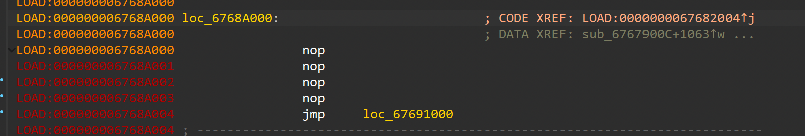
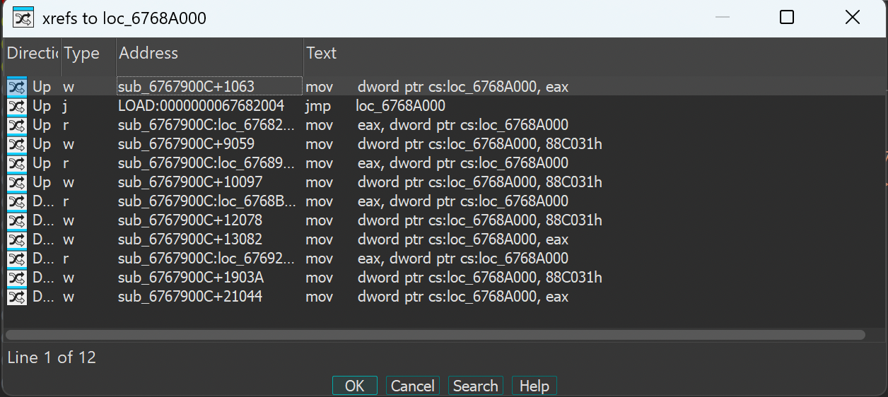

# LA CTF 2026: rev/starless-c

## Context 

`starless-c` is an excellent reverse engineering challenge written by aplet123 in LA CTF 2026. It requires classic reverse engineering skills in a complex context, combining careful analysis with the familiarity of WASD controls. 

We are given a binary, `starless_c`, a netcat server to connect to in order to retrieve the flag, and a short description:

```
The son of the fortune-teller stands before three doors. A bee. A key. A flag.
```

## Basic Static and Dynamic Analysis

As any reverse engineering process goes, we start by doing a basic static and dynamic analysis on the file. The binary is an ELF 64-bit LSB executable and contains the following strings of interest:

```
e flag.
ds to thPH
that leaPH
he path PH
hoose. TPH
you to cPH
ath for PH
ly one pPH
re is onPH
 Now thePH
ges ago.PH
s and paPH
any bytePH
, lost mPH
 is pastPH
ime thatPH
, in a tPH
hs, oncePH
many patPH
re were PH
low. ThePH
h to folPH
heir patPH
ge has tPH
 challenPH
r into aPH
 this faPH
A personP
flag.txtP
```

When running the binary, we are given a phrase and then are prompted for input. When trying a random character (that is apparently not correct), we get a type of error message:

```
mmstoic@server:~/personal/tmp$ ./starless_c
There is a flag in the binary.
  (The flag is a metaphor but also still a flag.)
  (The binary could rightly be considered a gimmick.)
p
And so the son of the fortune-teller does not find his way to the Starless C. Not yet.
```

With some strings to search for, we can begin our advanced static analysis in IDA. 

## Advanced Static Analysis in IDA

Immediately we see why our strings looked weird earlier: the binary is using a common obfuscation technique known as stack string obfuscation. Instead of writing the desired string in a `char*`, for example, the equivalent ASCII values of each letter are pushed onto the stack and get written out instead. This means that we can't just search for some text inside of the binary; we have to use the corresponding ASCII values instead. For example, to find where "flag.txt" resides in the file, we must instead search for `7478742E67616C66` or a subset like `7478742E` (".txt") (note the little endian ordering).

Putting this subset into the "Search for Sequence of Bytes" in IDA leads us to this section of the binary where we see another form of obfuscation taking place. Code is being interpreted as data. By pressing `c` we can transform the section into code and see specifically where the ".txt" bytes are.





We see this is the section of the binary that gives us the flag and prints a success message:

```
A person this far into a challenge has their path to follow. There were many paths, once, in a time that is past, lost many bytes and pages ago. Now there is only one path for you to choose. The path that leads to the flag.
```

Now that we know where our "win" function is, we can continue analyzing the binary and work our way towards the function.

Starting at the beginning of the binary, the intro message gets printed and a sigaction signal handler gets set on signal 11: SIGSEGV (segmentation fault/violation). We also see the handler for the signal is at `LOAD:0000000013370103`. The function here simply prints the error message stated above and then the program exits. So, we know that the reason we see this error message is because the program has segfaulted somewhere. Let's keep this in mind.

Looking at the main body of the binary at `LOAD:000000006767900C`, the logic starts by checking if the input from the user is `w`, `a`, `s`, `d`, or `f`. Each one of the WASD options does a similar thing:

1. Check if the contents at a certain function contains the byte `0x90`
2. If so, overwrite the first 4 bytes of that function's bytes with `0088C031` and overwrite the first 4 bytes of another function with `0x90` 
3. Jump to somewhere else in the code

Take note of the specific bytes being used here. `0x90` is the NOP byte in x86-64. It executes, but does nothing other than just advance the instruction pointer. `0x0088C031` is a series of two instructions: `xor eax, eax` and `move [rax], al`. This causes a null pointer dereference, which causes a segmentation fault. Thus, we can see here that NOP's and null pointer dereference instructions are being swapped at certain addresses in the binary, essentially allowing us to patch the segfault bytes. This seems to connect with the signal handler for SIGSEGV we saw earlier: the signal handler catches the segfaults at these functions if they are jumped to. 

We should also take note of where each WASD option jumps to. Sometimes, it leads to another set of WASD options, sometimes a completely different place futher along in the code, and sometimes goes back to earlier parts of the logic (to earlier WASD options). So, we can see here that the choice of WASD should be chosen carefully to not end up in an infinite loop.

Let's take a closer look at addresses that are inspected for NOP bytes, like the function at `LOAD:000000006767A000`:



We see the presence of `0088C031`, and if turned into code, it is indeed the seg fault-causing instructions.



We see another example at the function at `LOAD:000000006768A000`, which starts with NOP bytes instead of the segfault bytes. 



By further analyzing using cross-references, we can see that this NOP function's bytes are subject to being replaced with segfault-causing bytes during the code logic (see the `mov     dword ptr cs:loc_6768A000, 88C031h`, for example):



Before we make a conclusion about what's happening here, let's take a look at the `f` option present among every WASD crossroads. Every time `f` is pressed, we jump to a function at `LOAD:000000006767A000` which contains segfault bytes. That function then jumps to a function at `LOAD:0000000067682000` which also contains seg fault bytes, which then jumps to a function at `LOAD:000000006768A000` which, as we saw earlier, contains NOP bytes. This function then jumps to `LOAD:0000000067691000`, which contains more seg fault bytes, and then jumps to `LOAD:0000000067692000`, which contains more seg fault bytes, and then finally jumps to our flag-printing function we found earlier. So: we have a series of 5 function calls that all contain segfault-causing bytes except for one. This means that if we try to execute the `f` option before these segfault-causing bytes are patched, we will just get the error message.

After verifying this information by analyzing more WASD and `f` options and looking at cross-references of various segfault-containing functions, we may draw the following conclusion about what the binary is doing:

`starless-c` uses the user's input of `w`, `a`, `s`, `d`, and `f` to navigate through a series of logic checks. Each of these checks may swap 4 bytes present in one function for 4 bytes in another if a NOP is present at a given address. Because these bytes are either NOP bytes or segfault-causing bytes, we have the chance to either patch a segfault or introduce one. At any point, the user can enter `f` to jump through a series of functions to print the flag, but only if there are no segfault-causing bytes present. Thus, the user has to input the correct amount of `w`, `a`, `s`, `d`, and `f` inputs in the correct order to navigate the path to properly patch segfault-causing bytes to print the flag.


## Solution

Just one quick look at the binary will show that are a ton of WASD and `f` crossroads, so, this challenge can't be solved by going through all of the options manually. During the competition, I asked myself how to proceed with automating the solution. One way is to write a script, but I wasn't quite sure how to manage checking memory locations and traversing the paths of execution. Another way is to use AI, which would be the faster method (especialy in the context of the competition).

I didn't use AI at all during the initial stages of this challenge because I truly thought it would not be able to grasp the complexity of the program. But, I decided to give it a shot. After several failed attempts, I provided Codex (using GPT-5.3-Codex) a long and detailed description of the challenge and how to solve it, as well as my notes on the binary and how I would go about solving the problem if I did it manually. And I couldn't believe it -- it worked! My prompt can be found in `prompt.txt`. The solution steps are as follows:

```
sddddswaasdwaaasdssawwdwddsawasassdddwsddwasaaaawwdwdddsawaasassdddwwdwasssaaawwdwwassdddssddwasaaawwddwdsaaawdsassddwsddwawaawasdddssawdwaaddwaaf
```

The last step is to feed the solution steps into the netcat server. I generated a script (`feed_to_nc.py`) using Codex to do this, but it would be easy to do manually as well. Running the script, we can acquire the flag.

```
mmstoic@server:~/personal/tmp$ ./starless_c
There is a flag in the binary.
  (The flag is a metaphor but also still a flag.)
  (The binary could rightly be considered a gimmick.)
A person this far into a challenge has their path to follow. There were many paths, once, in a time that is past, lost many bytes and pages ago. Now there is only one path for you to choose. The path that leads to the flag.
lactf{starless_c_more_like_starless_0xcc}
```

## Remediation

This is your classic CTF reversing challenge that involves solving some kind of puzzle. However, if we pretend this binary was a piece of malware, reversing the binary can be made harder by using classic malware obfuscation techniques, like anti-reversing, packing, and anti-debugging tricks. Additionally, in the world of AI, using anti-LLM tricks to avoid automated analysis can highten the level of raw skill required to solve the challenge.

# Sources/Credits

Written by Madalina Stoicov
