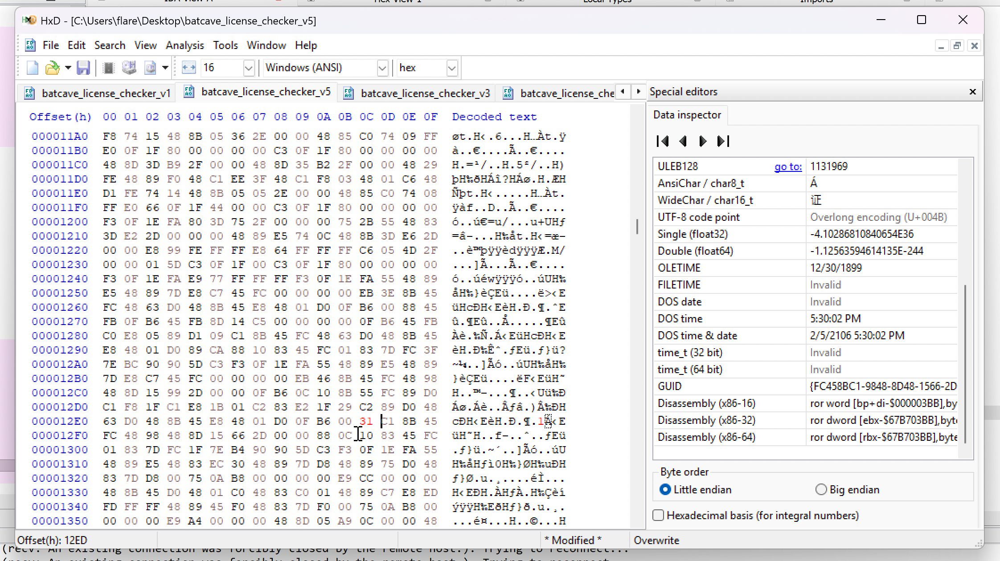

# UMASS CTF 2026: rev/Batcave Bitflips

## Context 

The challenge files include one binary named `batcave_license_checker` and the following description:

```
Batman's new state-of-the-art AI agent has deleted all of the source code to the Batcave license
verification program! There's an old debug version lying around, but that thing has been hit by
more cosmic rays than Superman!
```

## Basic Static and Dynamic Analysis

As with any reverse engineering challenge, we begin with basic static and dynamic analysis.

I ran `file`, saw this was an ELF x86 binary, and spun up my Linux server to run it. `strings` showed a few interesting things:

```
0123456789abcdef
=================================================================================
_-_-_-_-_-_-_-_-_-_-_- BATCAVE LICENSE VERIFICATION (Beta) _-_-_-_-_-_-_-_-_-_-_-
=================================================================================
ENTER LICENSE KEY: 
COMPUTING...
HASHED KEY: %s
VERIFYING...
INVALID LICENSE - PLEASE CONTACT ALFRED
LICENSE GOOD - DECRYPTING BAT DATA...
FLAG: %s
9*3$"
!_batman-robin-alfred_((67||67));Tu
```

Additionally, running the file confirmed that this challenge was a take on the classic "license-checking" RE challenge:

```
mmstoic@clac:~/personal/tmp/umass/batcave$ ./batcave_license_checker
=================================================================================
_-_-_-_-_-_-_-_-_-_-_- BATCAVE LICENSE VERIFICATION (Beta) _-_-_-_-_-_-_-_-_-_-_-
=================================================================================

ENTER LICENSE KEY: 12345
COMPUTING...
HASHED KEY: 0222db82e8613918515811e0e1aa2b900819339062a1e23069c1ab303b521b7a
VERIFYING...
INVALID LICENSE - PLEASE CONTACT ALFRED
```

Past "license-checking" challenges I've done have always involved looking into some kind of crypto, so I kept that in mind as I put the file into IDA.

## Advanced Static Analysis in IDA

The main function of the program takes in the key from the user, calls a hash function, converts the result of the hash function to hex so the hash can be printed, calls a verify function, and then prints the result of that verification. 

One small thing I noticed was the size passed into `fgets` to get the user's license key data: `0x21`, or 32 bytes and a NULL terminator. I wondered if one of the interesting strings I saw earlier fitted this description: `!_batman-robin-alfred_((67||67))`. Indeed, the string is 32 bytes (32 letters), but it didn't pass the license check.

```
mmstoic@clac:~/personal/tmp/umass/batcave$ ./batcave_license_checker
=================================================================================
_-_-_-_-_-_-_-_-_-_-_- BATCAVE LICENSE VERIFICATION (Beta) _-_-_-_-_-_-_-_-_-_-_-
=================================================================================

ENTER LICENSE KEY: !_batman-robin-alfred_((67||67))
COMPUTING...
HASHED KEY: fa189b817a02bbd3f1a88bf1c942211b80fa61fb39aa30708960d9020b71e0e3
VERIFYING...
INVALID LICENSE - PLEASE CONTACT ALFRED
```

Initially, I thought this string was just a red herring, so I ignored and continued my analysis.

### hash() function

This is the meat of the challenge. Careful static analysis revealed that the function takes the following steps:
* Use an `expand_state()` function to expand the 32-byte input to 64 bytes
* In a loop from 0 to 0xBEEEEE:
  - Call a `substitute()` function which replaces every byte in the array with its mapping in a given SBOX
  - Call a `mix()` function which diffuses the bytes in the array
  - Call a `rotate()` function which rotates the bytes in the array
* Collapse the array from 64 bytes back to 32 bytes in `derive_final()`
* In a `verify()` function, do a memcmp between the array and a given array of bytes
* If the verification passes, then the flag is decrypted in `decrypt_flag()`

During my analysis of these various functions I found 2 interesting bugs.

## Bugs & Vulnerabilities

### rotate() function

This is the core of the rotate function:

```
.text:000000000000125E
.text:000000000000125E                         loc_125E:               ; eax has value of counter
.text:000000000000125E 8B 45 FC                mov     eax, [rbp+counter]
.text:0000000000001261 48 63 D0                movsxd  rdx, eax        ; extend the value of counter
.text:0000000000001264 48 8B 45 E8             mov     rax, [rbp+input_bytes_extended] ; pointer to extended input array
.text:0000000000001268 48 01 D0                add     rax, rdx        ; move the pointer counter# in
.text:000000000000126B 0F B6 00                movzx   eax, byte ptr [rax] ; get the value at the array there
.text:000000000000126E 88 45 FB                mov     [rbp+byte_version_of_array_index], al ; get byte version of what's in the array at counter# index
.text:0000000000001271 0F B6 45 FB             movzx   eax, [rbp+byte_version_of_array_index] ; extend that byte value
.text:0000000000001275 8D 14 C5 00 00 00 00    lea     edx, ds:0[rax*8] ; edx = rax * 8 = rax << 3
.text:000000000000127C 0F B6 45 FB             movzx   eax, [rbp+byte_version_of_array_index] ; get that byte again, extended
.text:0000000000001280 C0 E8 06                shr     al, 6           ; shift that byte right by 6
.text:0000000000001283 89 D1                   mov     ecx, edx
.text:0000000000001285 09 C1                   or      ecx, eax        ; OR the bytes together: the one shifted left by 3 and the one shifted right by 6
.text:0000000000001287 8B 45 FC                mov     eax, [rbp+counter] ; move the value of the counter into eax
.text:000000000000128A 48 63 D0                movsxd  rdx, eax        ; extend the counter value into rdx
.text:000000000000128D 48 8B 45 E8             mov     rax, [rbp+input_bytes_extended]
.text:0000000000001291 48 01 D0                add     rax, rdx        ; move pointer counter# into the array
.text:0000000000001294 89 CA                   mov     edx, ecx        ; move the OR'd bytes from earlier into edx
.text:0000000000001296 88 10                   mov     [rax], dl       ; replace the value in the array with the OR'd bytes, but only take the last byte
.text:0000000000001298 83 45 FC 01             add     [rbp+counter], 1 ; increase the counter
```

The overall formula is essentially `extended_array[i] = (extended_array[i] << 3) OR (extended_array[i] >> 6)`. This may cause us to lose some information. Imagine we have a byte 0b11100001. Shifting the number 3 times to the left results in 0b00001000, and shifting the number 6 times to the right results in 0b00000011. OR'd together, we get 0b00001011, and we lose 1 bit of information. Since rotations are simply supposed to redistribute information and not lose it, this rotation is buggy. Instead, we should have two numbers that add up to 8 (because there are 8 bits in a byte), like 2 + 6, or 3 + 5.

### SBOX

I ran some tests against the provided SBOX to see if anything was out of order there. 

```python
sbox = [0xCF, 0x6E, 0xFE, 0x35, 0x46, 0x1A, 0xAD, 0x58, 0x78, 0x75, 
  0x73, 0x54, 0x84, 0x94, 0xFF, 0x70, 0x30, 0x07, 0x45, 0x34, 
  0xCD, 0x40, 0xF6, 0x5B, 0x43, 0xB4, 0x79, 0x72, 0xA2, 0x1B, 
  0xB2, 0x8E, 0xA0, 0x6D, 0x3C, 0x03, 0xEE, 0x47, 0xDF, 0x3D, 
  0x24, 0xB8, 0xD4, 0xD3, 0xD6, 0xC0, 0xBC, 0xE1, 0x38, 0xCB, 
  0xA3, 0x9C, 0xFC, 0xE0, 0xBD, 0xF2, 0x56, 0xDB, 0x2D, 0xA7, 
  0x37, 0x92, 0xE6, 0xC4, 0x91, 0x4F, 0x4E, 0x67, 0x39, 0xC3, 
  0x83, 0x87, 0x93, 0x25, 0x27, 0x81, 0x42, 0xD2, 0x89, 0x00, 
  0xF4, 0xE5, 0x08, 0xD8, 0x2B, 0x5A, 0x9A, 0x26, 0x0B, 0x5F, 
  0xF5, 0x64, 0x43, 0xA1, 0xF1, 0xB5, 0xE7, 0x8D, 0x9F, 0x98, 
  0xB7, 0xF0, 0x13, 0x2C, 0xB0, 0x97, 0x14, 0x7E, 0x19, 0x18, 
  0x8F, 0xB9, 0x23, 0xDD, 0x77, 0x52, 0x05, 0x09, 0x15, 0xEF, 
  0x88, 0xEA, 0xBF, 0x8C, 0x11, 0x76, 0x86, 0x60, 0x9B, 0xBA, 
  0x55, 0x95, 0xB3, 0x02, 0xFA, 0xDC, 0x1C, 0x49, 0x21, 0x59, 
  0x6F, 0xA4, 0x01, 0x06, 0x2A, 0x0E, 0xA5, 0x16, 0xE9, 0xB6, 
  0x5E, 0xE2, 0x8B, 0x74, 0xCA, 0x57, 0x90, 0x0F, 0x32, 0x2E, 
  0x4C, 0x1E, 0x62, 0x65, 0x1D, 0xA6, 0xC5, 0xAA, 0xC2, 0x41, 
  0x17, 0x69, 0xF8, 0x3A, 0xC9, 0x3B, 0xEB, 0x29, 0x6C, 0xDE, 
  0x10, 0x85, 0xC8, 0xC1, 0x99, 0x36, 0x1F, 0x63, 0x68, 0x3E, 
  0x4D, 0x5D, 0xD1, 0x9E, 0x20, 0xEC, 0xBE, 0xCE, 0x61, 0xB1, 
  0x0D, 0xA9, 0x4A, 0x96, 0x31, 0x9D, 0x22, 0xE4, 0xAC, 0x7C, 
  0xE3, 0x71, 0xE8, 0x7A, 0xFD, 0xF7, 0x2F, 0xAE, 0xC6, 0x8A, 
  0xF3, 0x33, 0xC7, 0x0C, 0x82, 0x53, 0xFB, 0xDA, 0x51, 0x7B, 
  0x04, 0xBB, 0x7F, 0x50, 0xA8, 0x6A, 0xAF, 0x6B, 0x48, 0x7D, 
  0x28, 0xF9, 0x3F, 0x12, 0xD5, 0x0A, 0x66, 0x80, 0xD0, 0x4B, 
  0x5C, 0xD7, 0xD9, 0xAB, 0xCC, 0xED]
```

Recall that SBOX's are meant to obscure the connection between the input and output by mapping every possible byte (from 0x00 to 0xFF) to some other byte. Thus, there are a few properties SBOX's should hold:
* No output byte should be reached by two different input bytes (ex: 0x00 and 0x01 cannot both map to 0xAB)
* Every possible input byte should exist somewhere in the SBOX. If you're covering 0x00 to 0xFF as inputs, each one of those values should be present somewhere in the SBOX. This also means there can be no duplicate values in the SBOX.

I ran a simple Python script (`sbox_checker.py`) to test some of these features, and found that the value 0x44 was missing from the SBOX. I noted that 0x44 is ASCII 68, so I checked the values for 0x43 (ASCII 67) and 0x45 (ASCII 69) (using my OSINT brain here). Indeed, I found that there were two 0x43's (ASCII 67's). This double 67 aligns with the key I found in strings earlier (`!_batman-robin-alfred_((67||67))`) and it made me think that maybe this key is the correct one after all.

## Patching & Solution

Putting it all together, I realized that maybe the challenge isn't necessarily about getting the key, but instead about patching the file so that the given key we found in strings (`!_batman-robin-alfred_((67||67))`) works. Since each of the bugs have two places that could be patched, we have 4 possible altered binaries:

1. v1: Change first 0x43 to 0x44 && change shift 3 to shift 2
2. v2: Change first 0x43 to 0x44 && change shift 6 to shift 5
3. v3: Change second 0x43 to 0x44 && change shift 3 to shift 2
4. v4: Change second 0x43 to 0x44 && change shift 6 to shift 5

### Applying the patches

I did all my patching in HxD, which comes pre-loaded on FlareVM! Some of these lines of assembly were a bit complex, so patching them required a bit of extra research.

### Patching the shift left from 3 to 2

Firstly, the shift left that happens in `rotate()` at address 0x1275 isn't just a `shl` instruction:

`.text:0000000000001275 8D 14 C5 00 00 00 00    lea     edx, ds:0[rax*8] ; edx = rax * 8 = rax << 3`

`ds:` refers to data segment, a concept that was needed for 32-bit systems to calculate addresses. In 64-bit systems, `ds` has a base of 0, so `ds:0` means an offset of 0 from the base, which is 0. Recall also that multiplying by 8 is the same as shifting left by 3. Thus, `lea     edx, ds:0[rax*8]` collapses into shifting the 8-byte value at `rax` left by 3 and storing that in `edx`. Later in `rotate()`, we isolate only the last byte of the value.

`8D 14 C5 00 00 00 00` represents this whole operation. 8D is the opcode for lea, 14 represents what register we're moving our value to and if we have an SIB byte to consider, and C5 is the SIB byte. 0xC5 = 0b11000101, where 000 represents the register we're taking from (`rax`), and 101 represents our base (`rbp`). 11 represents the scale, where:
* 00 = 1
* 01 = 2
* 10 = 4
* 11 = 8

To change our shifting from 3 to 2, we need to change the scale from 8 to 4. So, instead of C5, we get 0b10000101 = 0x85. Basically, to patch this shift left from <<3 to <<2, we change the bytes for the instruction to `8D 14 85 00 00 00 00`.

See [this link](https://wiki.osdev.org/X86-64_Instruction_Encoding) for more information on instruction encoding!

#### Patching the shift right from 6 to 5

Changing the amount we shift right is a lot easier, since the `shr` is directly used:

`.text:0000000000001280 C0 E8 06                shr     al, 6           ; shift that byte right by 6`

So, patching this is just involves changing 06 to 05. 

#### Patching the extra 67's in the SBOX

When it comes to the extra 67's in the SBOX, we can simply change either one of them from 0x43 to 0x44. The first 0x43 is at `.data:0000000000004098` and the second one is at `.data:00000000000040DC`.

#### Using the patched files & one last patch

Now that we have 4 patched files, we can try each of them to see which one allows us to pass the validation check. Version 2, which patched the first 0x43 to 0x44 and patched the shift right 6 to shift right 5, passed the verification! However, the flag output wasn't decrypted correctly:

```
mmstoic@clac:~/personal/tmp/umass/batcave$ ./batcave_license_checker_v2
=================================================================================
_-_-_-_-_-_-_-_-_-_-_- BATCAVE LICENSE VERIFICATION (Beta) _-_-_-_-_-_-_-_-_-_-_-
=================================================================================

ENTER LICENSE KEY: !_batman-robin-alfred_((67||67))
COMPUTING...
HASHED KEY: 3b54751a2406af05778047c5e483d348cb8730de1a9145ab15c79b2204022bee
VERIFYING...
LICENSE GOOD - DECRYPTING BAT DATA...
FLAG: ]u[w?_w?w????_???>?g?u??'+??n?5F?XxusT???p0E4?@?[D?yr???m<?G?=$???????8ˣ????V?-?7??đONg9Ã??%'?B҉
```

I took a look at the decryption function and noticed that the bytes of the encrypted data were being OR'd instead of XOR'd:

`.text:00000000000012EC 09 C1                   or      ecx, eax`

This means that applying the key onto the encrypted data wouldn't actually get us the plain text, since OR'ing doesn't have the same reversal effect as XOR'ing. So, I did one last patch to change the opcode of OR (09) to XOR (31) to make a fifth version of the binary.



Finally, this version was successful!

```
mmstoic@clac:~/personal/tmp/umass/batcave$ ./batcave_license_checker_v5
=================================================================================
_-_-_-_-_-_-_-_-_-_-_- BATCAVE LICENSE VERIFICATION (Beta) _-_-_-_-_-_-_-_-_-_-_-
=================================================================================

ENTER LICENSE KEY: !_batman-robin-alfred_((67||67))
COMPUTING...
HASHED KEY: 3b54751a2406af05778047c5e483d348cb8730de1a9145ab15c79b2204022bee
VERIFYING...
LICENSE GOOD - DECRYPTING BAT DATA...
FLAG: UMASS{__p4tche5_0n_p4tche$__#}
```

# Sources/Credits

Shoutout to gregt114 for the awesome challenge!

* https://en.wikipedia.org/wiki/ModR/M#SIB_byte
* https://wiki.osdev.org/X86-64_Instruction_Encoding
* https://en.wikipedia.org/wiki/S-box#
* Special thanks to my FlareVM and free IDA 🙏

Written by Madalina Stoicov
